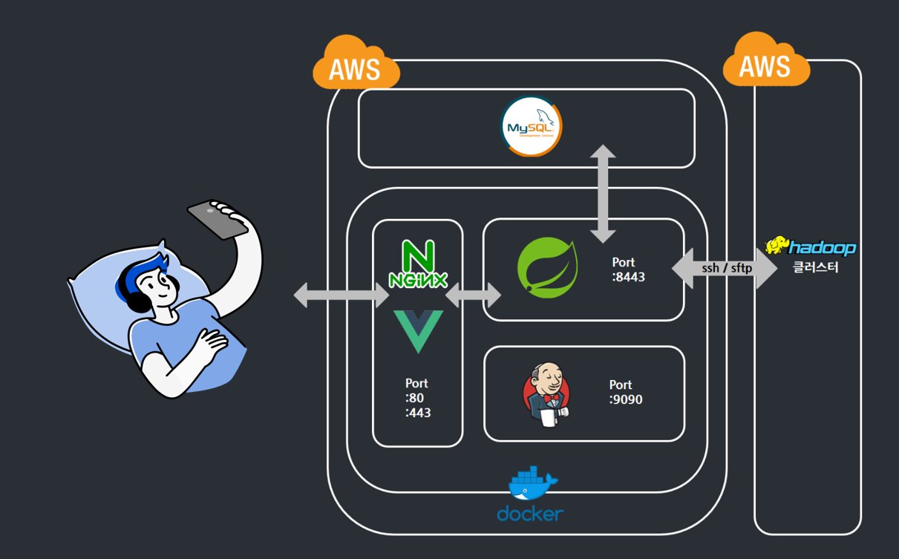
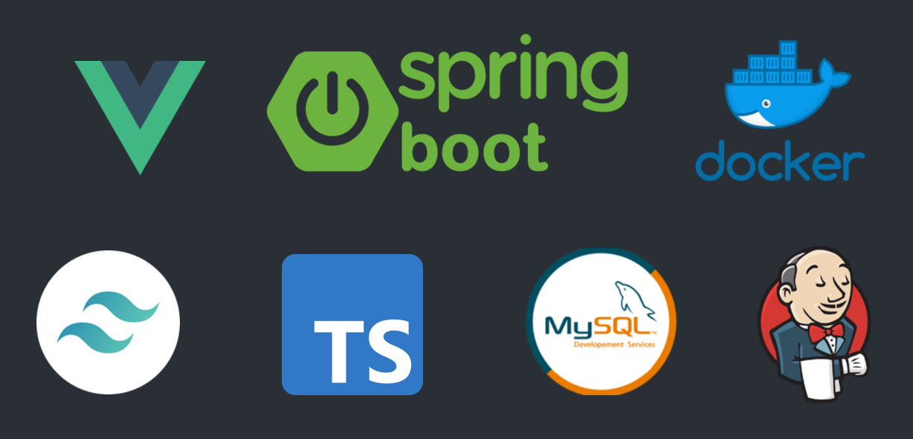

# 👨‍💻포팅 메뉴얼

## 설정값 및 버전

- 프론트엔드
  - 웹서버 : nginx
    - 1.20.1
  - node
    - 운영 서버 : lts
    - 개발 : 14.17.0
  - Vue.js 3.2.9
    - tailwindcss 2.2.14
    - vue-router 4.0.11
    - vuex 4.5.13
    - typescript 4.1.6
    - headlessui/vue 1.4.1
    - @j-t-mcc/vue3-chartjs 1.1.4
  
- 백엔드
  - WAS : springboot(v2.5.2) 안에 내장된 tomcat(v9.0.48)
  
  - JVM 8
  
  - STS 2.5.4
  
  - gradle : gradle-7.1.1-bin
  
  - openJDK8(zulu)
  
    

## Architecture 및 기술스택

## 배포 시 특이사항

- 우분투 서버에 mysql 직접 설치 후 백엔드와 연동
- 한시간 전 크롤링 데이터가 필수로 필요하기 때문에 한시간 이후 부터 실 서비스 제공 가능
- 백엔드 부분을 수정 후 배포할 경우 크롤링 주기로 배포가 되야하므로 프런트와 다른 브런치에 백엔드 브런치 배포를 통해 프런트 개발을 용이하게 함
- 배포 전 검색 쿼리 Table과 exception, requirement table이 필요함

## 데이터 베이스 접속

- DB이름 : ssafyspecial

- 버전

  8.0.26-0ubuntu0.20.04.2

- ER-Diagram

- 기본 import SQL

   [coordinate.sql](./exec/DB/coordinate.sql) 

   [제품, 크롤링키워드.sql](./exec/DB/제품, 크롤링키워드.sql) 

- DB dump File

  - exec 디비 테이블 생성문 참고

    

## 프로젝트에서 사용하는 외부 서비스 정보 문서

- 카카오 지도 사용
  - com.ssafy.special.controller.AdressToCoorUtils의 GEOCODE_USER_INFO에 자신의 카카오 키 입력 필요
  
    

## Docker Volume

- frontend Container

  - https key mapping

    server - /home/ubuntu/httpsKey/

    container - /var/empty/

- backend Container

  - 하둡 클러스터와 ssh 통신을 위한 서버 pem key

    server - /home/ubuntu/pemkey/

    container - /home/ubuntu/pemkey/

  - 하둡 클러스터로 보낼 데이터 input 타입

    server - /home/ubuntu/mysqltablefile/

    container - /home/ubuntu/mysqltablefile/
    
    

## 시나리오

- 기기의 제조사와 기종 스토리지를 선택해 당근마켓과 번개장터 중고나라 이 세 가지의 중고 웹 서비스의 물품을 검색 할 수 있습니다.

  또한 정렬 기능을 이용하여 마켓별 가격 및 게시글 생성 순 정렬이 가능합니다.

- 현 사용자 위치를 통해 해당 품목의 직거래(10km 이내) 가능 물품 리스트를 보여줍니다.

- 하둡 맵리듀스를 통해 inverted 및 self-join 구현하고 자카드 유사도 알고리즘을 통해 비슷한 게시글을 추천해 줍니다.

## 발표스크립트

[발표 스크립트](./발표/발표스크립트.md)
