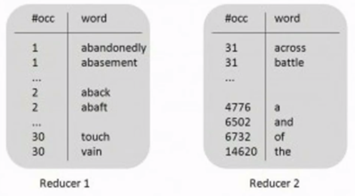
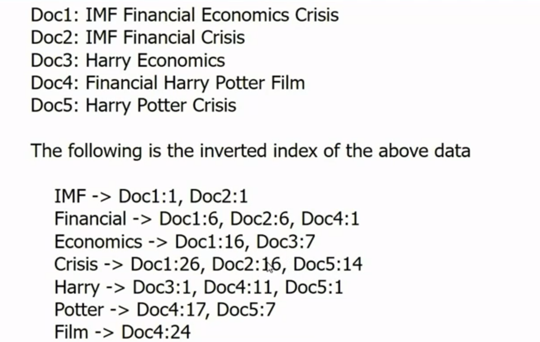

## 💻 빅데이터 분석 사전학습 2강


### Paritioner class

- Map 함수의 출력인 (key, value)쌍이 key에 의해서 어느 Reducer(머신)으로 보내질 것인지를 정해지는데 이러한 결정을 정의하는 Class

- 하둡의 기본 타입은 Hash 함수가 Default로 제공되고 있어서 Key에 대한 해시 값에 따라

  어는 Reducer(머신)으로 보낼지를 결정한다.

  

  ```java
  import org.apache.hadoop.mapreduce.Partitioner;
  
  public static class MyPartitioner extends Partitioner <IntWritable, Text>{
  				@Override
  				public int getPartition(IntWritable key, Text value, int numPartitions){
  							int nbOccurences = key.get(); // 키 값을 뽑아냄
  							if(nbOccurences <= 30) return 0;  //0번 머신
  							else return 1;                    //1번 머신
  				}
  }
  ```

  Main 함수에 추가

  ```java
  job.setPartitionerClass(MyPartitioner.class);
  ```

### 하둡 실행 기본 명령어

```java
$ ant
$ hdfs dfs -rm -r wordcount_test_out
$ hadoop jar ssafy.jar wordcountsort wordcount_test wordcount_test_out
$ hdfs dfs -cat wordcount_test_out/part-r-00000 | more
$ hdfs dfs -cat wordcount_test_out/part-r-00001 | more
```

### hadoop Connection refused Error 시 check

```java
$ jps //실행후 hadoop node 올라가있는지 확인
$ start-dfs.sh //만일 없다면 실행
```

### Inverted Index

- key값이 어느 문서에 존재하는 어느 위치에 있는지 list




