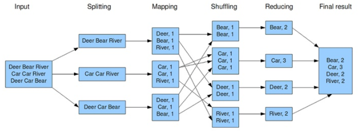

## 📰 빅데이터 분석 사전학습 1강


#### MapReduce Programing Model

-  함수형 프로그래밍 언어의 형태
- 유저는 아래 3가지 함수를 구현해서 제공
  - Main 함수
  - Map 함수 (key1, val1)  ->  [(key2, val2)] 
  - Reduce 함수 (key2, [val2])  ->  [(key3, val3)] 


#### MapReduce Phase (3단계)

- 맵(Map) 페이즈

  - 제일 먼저수행되며 데이터의 여러 파티션에 병렬 분산으로 호출되어 수행된다.
  - 각 머신마다 수행된 Mapper는 맵 함수가 입력 데이터의 한 줄 마다 맵 함수를 호출한다.
  - 맵 함수는 (key, value)쌍 형태로 결과를 출력하고 여러 머신에 나누어 보내면 같은 key를 가진 (key, value) 쌍은 같은 머신으로 보내진다.

- 셔플링(Shuffling) 페이즈

  - 모든 머신에서 맵 페이즈가 다 끝나면 시작된다.

  - 맵 페이즈에서 각각의 머신으로 보내진 (key, value) 쌍을 KEY를 이용해서 정렬을 한 후

    각각의 KEY 마다 같은 KEY를 가진 (key, value) 쌍을 모아서 밸류-리스트(value-list)를 만든 다음에 

    (key, value-list)형태로 KEY에 따라서 여러 머신에 분산해서 보낸다.

- 리듀스(Reduce) 페이즈

  - 모든 머신에서 셔플링 페이즈가 다 끝나면 각 머신마다 리듀스 페이즈가 시작된다.

  - 각각의 머신에서는 셔플링 페이즈에서 해당 머신으로 보내진 각각의 (key, value-list) 쌍 마다 리듀스 함수가 호출되며

    하나의 리듀스 함수가 끝나면 다음 (key, value-list) 쌍 리듀스 함수가 호출

  - 출력이 있다면 (key, value) 쌍 형태로 출력





#### MapReduce 입출력 Default 클래스

- 하둡의 맵리듀스의 맵함수, 리듀스함수, 컴바인 함수 등에서 입출력에 사용할 수 있는 클래스와 해당되는 자바 타입
  - Text : String
  - IntWritable : int
  - LongWritable : long
  - FloatWritable : float
  - DoubleWritable : double 
- 만일 새로운 클래스를 정의해서 입출력에 사용하고 싶다면 필요한 여러 함수도 함께 정의를 같이 해주어야만 한다.


#### Combine 함수

- 리듀스 함수와 유사한 함수인데 각 머신에서 맵 페이즈에서 맵 함수의 출력 크기를 줄여서 

  셔플링 페이즈와 리듀스 페이즈의 비용을 줄여주는데 사용

```java
public static void main(String[] args) throws Exception {
		Configuration conf = new Configuration();
		String[] otherArgs = new GenericOptionsParser(conf,args).getRemainingArgs();
		if ( otherArgs.length != 2 ) {
			System.err.println("Usage: <in> <out>");
			System.exit(2);
		}
		Job job = new Job(conf,"word count");
		//job
		job.setJarByClass(Wordcount1char.class);

		// let hadoop know my map and reduce classes
		job.setMapperClass(TokenizerMapper.class);
    	// Reduce 함수를 맵 페이즈 끝나고 수행]
    	job.setCombinerClass(IntSumReducer.class); 		// Combiner class 선언
		job.setReducerClass(IntSumReducer.class);
		
		job.setOutputKeyClass(Text.class);				//Output key type선언
		job.setOutputValueClass(IntWritable.class);		//Output value type선언
		//job.setMapOutputKeyClass(Text.class);					//Map is different from Reducer fnc output key type
		//job.setMapOutputValueClass(IntWritable.class);		//Map is different from Reducer fnc output value type

		// set number of reduces
		job.setNumReduceTasks(2);

		// set input and output directories
		FileInputFormat.addInputPath(job,new Path(otherArgs[0]));
		FileOutputFormat.setOutputPath(job,new Path(otherArgs[1]));
		System.exit(job.waitForCompletion(true) ? 0 : 1 );
	}

```

